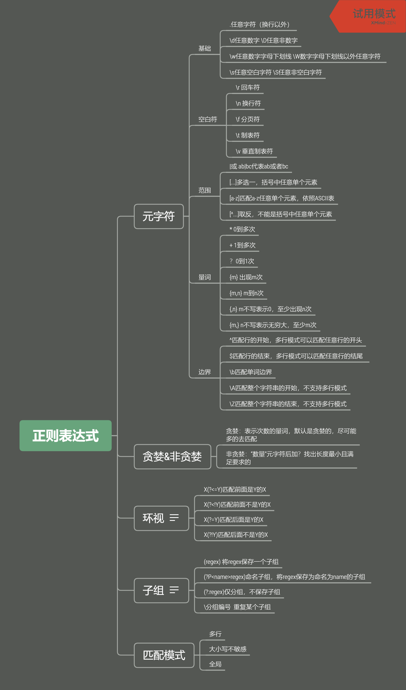

# 正则表达式
## 定义及作用
文本处理的工具，描述字符串的规则，主要作用如下：
1. 校验数据的有效性；
2. 从文本中提取内容；
3. 文本内容的替换。

## 知识体系

## 学习资源
- https://regex101.com/
- https://deerchao.cn/tutorials/regex/regex.htm
- https://github.com/ziishaned/learn-regex
- 书籍：《精通正则表达式》、 《正则指引》、《正则表达式必知必会》